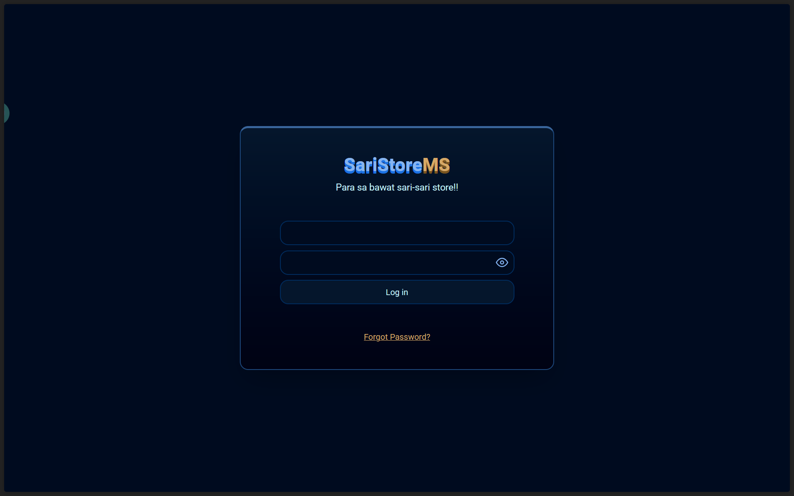

# 🏪 SariStore MS

> **Work in Progress** – A comprehensive management system for Filipino sari-sari store operators and employees  
> **📱 Note**: This system currently supports desktop only. Mobile support is **coming soon**.

## 📸 Screenshots

### Login Page
  
*Modern, clean login interface for store employees*

### Dashboard (Coming Soon)
  
*Main dashboard showing sales overview and quick actions*

> **Note**: More screenshots will be added as features are implemented

## 📋 Overview

**SariStore MS** is a modern point-of-sale and inventory management system specifically designed for sari-sari stores in the Philippines. This system helps store owners and employees manage daily operations, track inventory, handle customer credit ("utang"), and generate sales reports.

> ⚠️ **Mobile Support Coming Soon**  
> This app is **desktop-first**, and mobile functionality is planned in a future update.

## 🚀 Tech Stack

- **Frontend**: SvelteKit
- **Backend**: Node.js + Express.js
- **Database**: PostgreSQL (SQLite for development)
- **ORM**: Sequelize

## ✨ Planned Features

### 👥 User Management
- [ ] Role-based access control (Admin, Manager, Cashier, Inventory Clerk)
- [ ] Employee profiles and authentication
- [ ] Secure password management

### 🛒 Sales Management
- [ ] Point-of-sale interface
- [ ] Barcode scanning support (if able to)
- [ ] Multiple payment methods (Cash, GCash, etc.)
- [ ] Receipt generation
- [ ] Daily sales reporting

### 📦 Inventory Management
- [ ] Product catalog management
- [ ] Stock level tracking
- [ ] Low stock alerts
- [ ] Automatic reorder notifications
- [ ] Supplier management

### 💳 Customer Credit System ("Utang")
- [ ] Customer profile management
- [ ] Credit limit tracking
- [ ] Payment history
- [ ] Due date reminders
- [ ] Outstanding balance reports

### 📊 Reporting & Analytics
- [ ] Daily/weekly/monthly sales reports
- [ ] Inventory turnover analysis
- [ ] Customer credit status
- [ ] Profit margin tracking

## 🏗️ Project Structure

```
saristore-ms/
├── client/                 # SvelteKit frontend
│   ├── src/
│   ├── static/
│   └── package.json
├── server/                 # Express.js backend
│   ├── src/
│   │   ├── models/        # Sequelize models
│   │   ├── routes/        # API endpoints
│   │   ├── middleware/    # Authentication, validation
│   │   └── config/        # Database & app configuration
│   └── package.json
├── screenshots/           # Project screenshots
│   ├── login-page.png
│   └── dashboard-preview.png
└── README.md
```

## 🛠️ Development Setup

### Prerequisites
- Node.js (v18 or higher)
- PostgreSQL (for production)
- Git

### Installation

1. **Clone the repository**
   ```bash
   git clone https://github.com/yourusername/saristore-ms.git
   cd saristore-ms
   ```

2. **Backend Setup**
   ```bash
   cd server
   npm install

   # Create environment file from template
   cp .env.example .env
   # Edit .env with your configuration (see Environment Variables section)

   # Run database migrations
   npm run migrate

   # Seed initial data
   npm run seed

   # Start development server
   npm run dev
   ```

3. **Frontend Setup**
   ```bash
   cd client
   npm install

   # Start development server
   npm run dev
   ```

4. **Access the application**
   - Frontend: http://localhost:5173
   - Backend API: http://localhost:3000

## 🗄️ Database Schema

The system uses a comprehensive relational database design with the following key entities:

- **Profiles** – Personal information for users and customers  
- **Accounts** – Employee login credentials and roles  
- **Roles & Permissions** – Access control system  
- **Products** – Store inventory items  
- **Sales & SaleItems** – Transaction records  
- **Customers** – Customer information and credit limits  
- **Utangs** – Customer credit/debt tracking  
- **UtangPayments** – Payment history for customer debts  

## 🔧 Environment Variables

Create a `.env` file in the server directory with the following variables:

```env
# Database Configuration
DB_TYPE=SQLITE                    # Use SQLITE for development, POSTGRESQL for production
DB_HOST=localhost                 # Database host (PostgreSQL only)
DB_PORT=5432                      # Database port (PostgreSQL only)
DB_NAME=saristore                # Database name (PostgreSQL only)
DB_USER=your_username            # Database username (PostgreSQL only)
DB_PASSWORD=your_password        # Database password (PostgreSQL only)

# Server Configuration
NODE_ENV=development              # Environment: development, production, test
PORT=3000                         # Server port
JWT_SECRET=your_secret_key       # JWT signing secret (generate a strong random string)
```

> 🔐 **Important**:  
> - Never commit your `.env` file to version control  
> - Use strong, unique passwords and secrets  
> - For development, you can use SQLite (no additional setup required)  

## 📝 Development Progress

### ✅ Completed
- [x] Database schema design
- [x] Sequelize models setup
- [x] Database configuration
- [x] Basic project structure
- [x] Login page UI design
- [x] SvelteKit frontend setup
- [x] Model associations and relationships

### 🔄 In Progress
- [ ] Authentication middleware
- [ ] Login functionality
- [ ] Basic API endpoints

### 📋 To Do
- [ ] User interface design
- [ ] API integration
- [ ] Testing implementation
- [ ] Documentation

## 🤝 Contributing

This is a personal learning project, but suggestions and feedback are welcome! Feel free to:

- Report bugs or issues
- Suggest new features
- Share improvement ideas
- Provide code reviews

## 📄 License

This project is for educational and personal use.

## 🎯 Project Goals

- Learn modern web development practices
- Understand business requirements for Filipino sari-sari stores
- Build a practical solution for small business management
- Explore full-stack development with modern tools

---

**Note**: This is an ongoing personal project developed for learning purposes. Features and implementation details may change as development progresses.  
**Currently desktop-only – mobile support is planned.**

## 📞 Contact

For questions or suggestions about this project, feel free to reach out!

---
*Last updated: July 2025*
